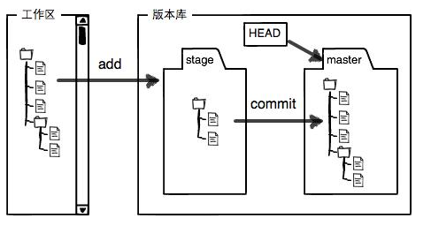

# Git command

版本库又名仓库(**repository**)
Git Bash

## 列出隐藏文件
`ls -ah`

## 显示文件内容
`cat <yourfile>`

## 仓库初始化
`cd <your_repository>`
`git init`

## 把文件添加到仓库
`git add <yourfile>`

## 把文件提交到仓库
`git commit -m "wrote a readme file"`
> `-m` 后面输入的是本次提交的说明
> `1 file changed`: 1个文件被改动
> `3 insertions`: 插入了3行内容

why two steps? `add` + `commit`
> 因为`commit`可以一次提交很多文件，所以可以多次`add`不同的文件

## 查看仓库当前状态
`git status`

## 查看difference
`git diff <yourfile>`

## 查看日志
`git log`
`git log --pretty=oneline`

## 版本回退
`git reset --hard <version>`
`git reset --hard HEAD^`
`git reset HEAD <file>`
> `HEAD` 指向当前版本 `HEAD^` 指向上一个版本 `HEAD^^` 指向上上个版本 `HEAD~100`

## 查看记录的命令
`git reflog`
> 找记录，查看版本号，回退版本

## 工作区和暂存区
工作区(Working Directory) --电脑里能看到的目录，如`Git`文件夹就是一个工作区
版本库(Repository) --工作区有一个隐藏目录`.git`,是Git版本库。其中最重要的是称为**stage**(*index*)的暂存区,还有Git自动为我们自动创建的第一个分支`master`，以及一个指向`master`的一个指针`HEAD`。

## 管理修改
`Git`跟踪并管理的是修改，而非文件。

## 撤销修改
`git restore --worktree <yourfile>`
> 从暂存区恢复工作区(stage->worktree)
`git restore -staged <yourfile>`
> 从master恢复暂存区(matser->stage)
`git restore --source=HEAD --staged --worktree <file>`
> 从master同时恢复工作区和暂存区

## 删除文件
`rm <file>`
`git rm <file>` `git add <file>`
`git commit`
> 手动删除文件，然后在`master`删除，提交
`git restore <file>`
> 手动删除后从版本库里恢复

## 添加远程库